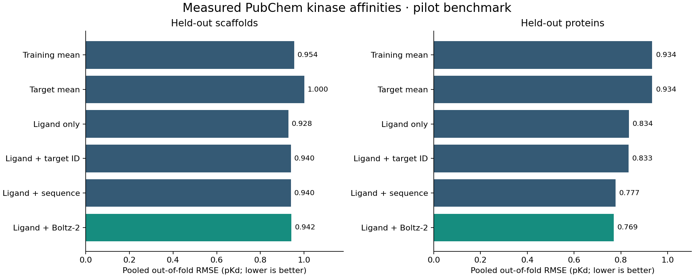
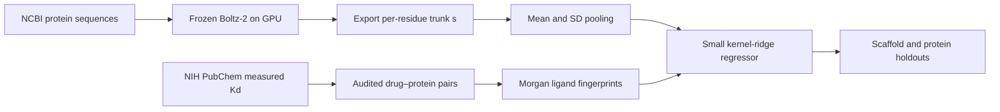

# Boltz Kinase Encoder

**Use a frozen protein-folding model as a feature encoder, then train a small drug–target affinity regressor.**

A reproducible pilot built from NIH-hosted PubChem assay measurements and NCBI reference sequences. It compares ligand-only, target-identity, and sequence baselines with a workflow for adding Boltz-2's exported protein representations.

> **Current status:** the complete GPU workflow ran on one A100. All 12 proteins produced actual Boltz-2 embeddings, and the downstream regressor was trained and evaluated. Imported artifacts and local reproduction checks passed. **RDKit molecule-serialization warnings remain unresolved**; results are a provisional pilot, not a compatibility-certified benchmark. Boltz-2 itself was not fine-tuned.



## The experiment

Can a frozen Boltz-2 protein representation improve a small affinity model over simple molecular and protein features?



Boltz-2 runs once per reference protein, using protein-only inputs. The learned residue vectors are pooled and cached. Drug fingerprints and protein-vector similarities define a small regression kernel trained on measured pKd values. The folding model stays frozen, and its existing affinity head is not used.

## Dataset

The committed snapshot contains **173 measured pairs, 34 distinct parent compounds, 33 Bemis–Murcko scaffolds, and 12 human kinase reference proteins**:

`AURKA, AURKB, AURKC, CDK2, CDK7, CSNK1D, CSNK1E, FRK, GSK3B, HCK, LCK, SRC`.

- Source: [PubChem BioAssay AID 1433](https://pubchem.ncbi.nlm.nih.gov/bioassay/1433), deposited by Ambit Biosciences; primary study [PMID 18183025](https://pubmed.ncbi.nlm.nih.gov/18183025/).
- Protein sequences: exact versioned accessions from the assay, downloaded through [NCBI E-utilities](https://www.ncbi.nlm.nih.gov/books/NBK25501/).
- Labels: `pKd = 6 − log10(Kd in μM)`. Both assay metadata and CSV unit headers are checked.
- Only numeric, positive, unqualified recorded Kd measurements from exact selected panel names are retained. Unmeasured pairs are **not** treated as inactive.
- Mutant panels are excluded by exact name matching. Duplicate target/parent pairs would be aggregated by median pKd.
- Molecules are represented by the largest heavy-atom fragment and canonical isomeric SMILES. No tautomer standardization or protonation-state inference is performed.
- SHA-256 hashes, retrieval URLs, filtering counts, sequence versions, and label provenance are saved in the [dataset card](data/processed/dataset_card.json).

This is a sparse, selected follow-up affinity panel, not a random screen or a balanced binder/nonbinder dataset. The NCBI sequences are reference proteins; the exact experimental constructs were not verified. See [DATA_CARD.md](docs/DATA_CARD.md).

## Run on a Mac or CPU machine

Python 3.10–3.12. From the repository root:

```bash
python3 -m venv .venv
source .venv/bin/activate
python -m pip install -e .

# Offline: the small real-data snapshot is included.
kinase-encoder curate
kinase-encoder evaluate --output results/local-baseline
kinase-encoder fit --method ligand_sequence --output models/sequence_baseline.npz
python -m unittest discover -s tests -v
```

To retrieve a fresh public snapshot instead of using the committed one:

```bash
kinase-encoder fetch
kinase-encoder curate
```

A fresh upstream snapshot may change; the committed results correspond to their recorded hashes. Fetching replaces the raw snapshot, and curation replaces the processed tables. Use a separate checkout to preserve an older dataset.

## Completed GPU benchmark

These are pooled out-of-fold RMSE values in pKd units; lower is better.

| Model | Held-out scaffolds | Held-out proteins |
|---|---:|---:|
| Training mean | 0.954 | 0.934 |
| Target mean | 1.000 | 0.934 |
| Ligand only | 0.928 | 0.834 |
| Ligand + target ID | 0.940 | 0.833 |
| Ligand + sequence features | 0.940 | 0.777 |
| Ligand + Boltz-2 | 0.942 | 0.769 |

Sequence features help on the target-held-out protocol in this pilot, but scaffold generalization is weak: the sequence baseline has R² ≈ −0.022 there. The ligand-only scaffold R² is approximately zero. These are descriptive results from a small dataset, not evidence of prospective drug-discovery performance or statistically established superiority.

Boltz reduces protein-held-out RMSE from 0.777 for sequence features to 0.769, but does not improve scaffold-held-out RMSE (0.942 versus 0.940). Its protein-held-out Spearman correlation is lower than the sequence baseline (0.413 versus 0.430). This small mixed result does not establish statistical superiority.

Full [metrics](results/boltz/metrics.json), [out-of-fold predictions](results/boltz/predictions.csv), [fold assignments](results/boltz/folds.csv), and [interpretation](results/boltz/report.md) are included. The original CPU-only baseline is preserved under `results/baseline/`. No hyperparameters were chosen by optimizing these test scores.

## Reproduce the completed GPU phase

Prepare 12 single-chain YAML inputs locally:

```bash
kinase-encoder prepare-gpu --output gpu/inputs
```

This also creates `gpu/inputs.manifest.json` **outside** the YAML directory, because Boltz rejects non-sequence files inside the input directory.

On a Linux CUDA machine, create a separate Python environment and install the pinned upstream revision:

```bash
python3 -m venv .venv-gpu
source .venv-gpu/bin/activate
python -m pip install -r requirements-gpu.txt

python scripts/run_encoder.py --inputs gpu/inputs --output gpu/run --cache gpu/cache
kinase-encoder collect --inputs gpu/inputs --run gpu/run --output data/features/boltz2.npz

kinase-encoder evaluate --embeddings data/features/boltz2.npz --output results/local-boltz
kinase-encoder fit --method ligand_boltz --embeddings data/features/boltz2.npz --output models/boltz_regressor.npz
```

Activate a CUDA-compatible PyTorch environment for your machine. The completed job used one A100-PCIE-40GB and requested 48 GB host RAM; 8m26s is the scheduler elapsed time, including preprocessing, inference, and downstream analysis, not a portable inference benchmark. A [Frontenac job script](scripts/full_frontenac.slurm) and generic [Slurm template](scripts/encode.slurm) are included. Adapt account and environment paths to your cluster; Frontenac selected the partition automatically. Boltz downloads model/chemical-component assets on first use, and full pair embeddings can consume substantial disk space. Those assets and outputs are excluded from Git.

The prepared default uses the public MSA server for these public reference sequences. `prepare-gpu --msa-mode single` explicitly creates reduced-information single-sequence inputs instead; record that choice when comparing results. The runner uses one device, seed 17, three recycling steps, 200 diffusion steps, one structure sample, and `--no_kernels` for portability. It verifies the installed Boltz Git revision and records run status, command, input hashes, and the downloaded checkpoint hash.

The pinned [upstream revision](https://github.com/jwohlwend/boltz/tree/b1ebfc46ecf57f5414e0d1a6f9027bbb122c53bc) supports `--write_embeddings`. It writes `embeddings_<target>.npz` containing `s` and `z`; this project reads only `s`, the final trunk single representation. It is a latent feature of the folding model, not a geometric descriptor calculated from a finished PDB structure.

The collector checks completion, input hashes, sequence identity, dimensions, and finite values, then concatenates residue-wise mean and population SD. For the generated one-chain canonical-protein inputs, the first sequence-length tokens correspond to residues; trailing padding is excluded. Multi-chain, modified-residue, and ligand-containing exports are not supported by this pooling assumption. The JSON provenance files are audit records, not cryptographic attestations of a remote run.

## Evaluation and model details

- **Ligand features:** radius-2 Morgan bit fingerprints, 1,024 bits, compared with Tanimoto similarity.
- **Sequence baseline:** 20 amino-acid frequencies plus 400 dipeptide frequencies.
- **Boltz features:** concatenated residue-wise mean and SD of the frozen `s` representation, then per-protein L2 normalization.
- **Protein similarity:** RBF kernel on normalized vectors. Its squared-distance bandwidth is the median positive distance between distinct **training** vectors in each fold. The target-ID control uses exact identity instead.
- **Joint kernel:** `K = K_ligand × (0.5 + 0.5 × K_protein)`. This retains a ligand-only component and adds protein-conditioned similarity.
- **Regressor:** kernel ridge with prespecified α = 1, using only the training-label mean for centering. Only this small regressor is fit.
- **Scaffold protocol:** five-fold grouped cross-validation by nonchiral Bemis–Murcko scaffold. No scaffold or identical parent compound crosses a train/test boundary. Protein targets can occur in both partitions.
- **Protein protocol:** leave one of the 12 targets out at a time. Compounds may occur in both partitions; this is not a simultaneous new-protein/new-scaffold test.

The historical assay may overlap Boltz pretraining sources. Downstream splitting does not establish pretraining decontamination. Protein-only frozen embeddings avoid using the ligand-affinity prediction head, but do not guarantee independence from historical training data. See [MODEL_CARD.md](docs/MODEL_CARD.md).

## Candidate prediction interface

After fitting a final model, prepare a CSV with `candidate_id,target_id,smiles` columns and run:

```bash
kinase-encoder predict --model models/sequence_baseline.npz --candidates candidates.csv --output predictions.csv
```

Target IDs must be among those stored in the model. Outputs include the model method, so baseline predictions cannot be mistaken for Boltz-feature predictions. This is an inference-interface demonstration, not a validated ranking service for new drug candidates. The tiny pilot has no applicability-domain or calibrated uncertainty model.

The completed [Boltz-feature regressor](artifacts/boltz_regressor_12247627.npz) and [pooled embeddings](artifacts/boltz2_12247627.npz), each with JSON provenance, are included under `artifacts/`.

Models are saved as numeric/string NPZ arrays with JSON metadata rather than pickle. Fitting uses all curated rows; assess predictive performance using the separate out-of-fold reports, not predictions on those training pairs.

## Project layout

```text
config/pilot.json             Explicit assay panels and protein accessions
data/raw/                     Public source snapshot and download provenance
data/processed/               Curated labels, reference sequences, dataset card
src/boltz_kinase_encoder/      Curation, features, evaluation, training, inference CLI
scripts/                      Pinned Boltz GPU runner and Slurm example
results/baseline/              Original CPU baseline
results/boltz/                 Actual GPU benchmark, structures, provenance, and audit
artifacts/                    Pooled Boltz embeddings and final small regressor
tests/                        Curation, split, kernel, serialization, and encoder-contract tests
docs/                         Dataset and model cards
```

Tests run without a GPU or network. Encoder tests use explicitly synthetic tensors to validate the import/pooling contract; they test the import contract separately from the real run recorded in `results/boltz/`. GitHub Actions is configured for CPU tests and baseline smoke evaluation, not GPU inference.

## Credits and licensing

Software in this repository: MIT. Upstream [Boltz](https://github.com/jwohlwend/boltz) has its own license and attribution requirements. The downloaded numerical assay data are contributed by Ambit Biosciences and hosted by NIH PubChem; reference sequences come from NCBI. This repository's software license does not relicense third-party data. Preserve source attribution and consult provider terms when reusing the data. NIH hosting is not NIH endorsement of this project.

## Artifact audit and unresolved warning

The [audit](results/boltz/audit.json) verifies input, embedding, and final-model hashes; all 12 sequence identities; complete backbone atoms; finite coordinates; and bounded confidence values. Peptide C–N distances span 1.248–1.359 Å, and no heavy-atom pair is closer than 0.8 Å. These are basic integrity checks, not a full geometry or experimental-accuracy validation. Mean per-protein pLDDT ranges from approximately 0.647 to 0.893.

Local evaluation with the downloaded embeddings reproduces all out-of-fold predictions within 2.4e-14 pKd and non-rank metrics within 2.3e-15. Spearman values differ by at most 0.000864 because near-tied predictions can change rank under floating-point roundoff; the published table retains the original HPC values.

The stderr log contains 42 RDKit warnings about reading molecular serialization version 16.2 with a 16.1 reader. The same message is [reported upstream](https://github.com/jwohlwend/boltz/issues/477), but successful execution and a closed issue do not prove compatibility. A matched-version rerun has not been done. See [the validation note](docs/GPU_VALIDATION.md).

To reproduce evaluation without another GPU run:

```bash
kinase-encoder evaluate --embeddings artifacts/boltz2_12247627.npz --output results/local-reproduced
```
