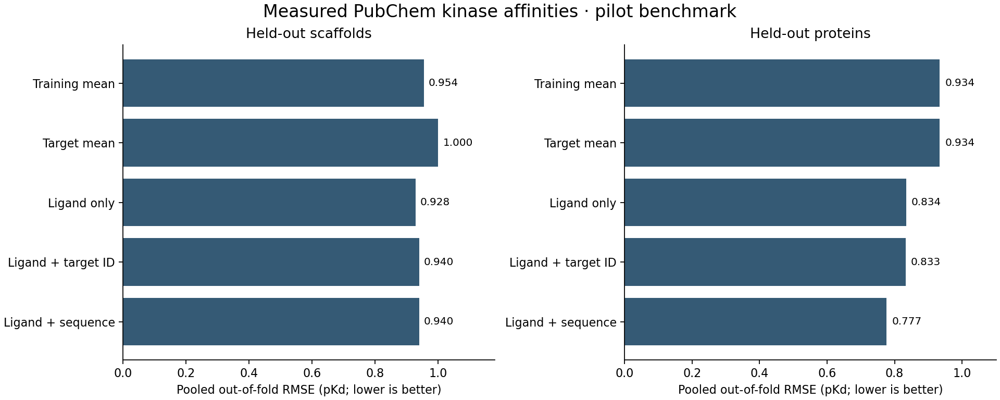

# Pilot results

**Boltz-2 extraction has not run. These are baseline results only.**

173 measured pairs · 34 compounds · 12 targets · 33 scaffolds

| Protocol | Model | RMSE ↓ | MAE ↓ | R² | Spearman |
|---|---|---:|---:|---:|---:|
| scaffold | Training mean | 0.954 | 0.746 | -0.054 | -0.244 |
| scaffold | Target mean | 1.000 | 0.769 | -0.159 | -0.059 |
| scaffold | Ligand only | 0.928 | 0.722 | 0.003 | 0.053 |
| scaffold | Ligand + target ID | 0.940 | 0.727 | -0.022 | 0.031 |
| scaffold | Ligand + sequence | 0.940 | 0.725 | -0.022 | 0.022 |
| target | Training mean | 0.934 | 0.736 | -0.010 | -0.275 |
| target | Target mean | 0.934 | 0.736 | -0.010 | -0.275 |
| target | Ligand only | 0.834 | 0.672 | 0.194 | 0.267 |
| target | Ligand + target ID | 0.833 | 0.674 | 0.197 | 0.268 |
| target | Ligand + sequence | 0.777 | 0.628 | 0.301 | 0.430 |

## Interpretation

These are pooled predictions for rows held out from their downstream training fold. Negative R² means performance is worse than the constant predictor defined using the full evaluation-label mean; the training-mean baseline is also reported separately.

Scaffold holdout evaluates new chemical scaffolds among these targets. Target holdout evaluates an unseen protein while allowing known compounds. Neither establishes simultaneous new-protein/new-scaffold generalization.

The sparse panel contains reported follow-up affinity measurements; unmeasured pairs were never turned into negatives. Reference sequences may differ from experimental constructs. A small historical dataset cannot establish prospective drug-discovery performance.

Boltz-2 protein-only embeddings are frozen inputs. The downstream kernel-ridge regressor is the only trained model. Pretraining overlap has not been audited. Hyperparameters were not selected using these held-out scores.
